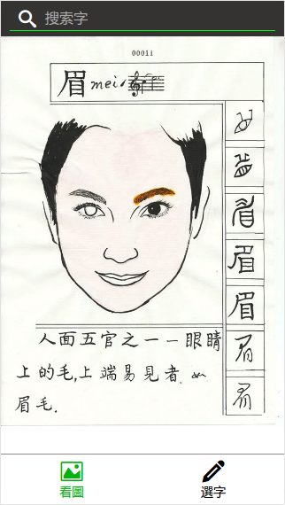
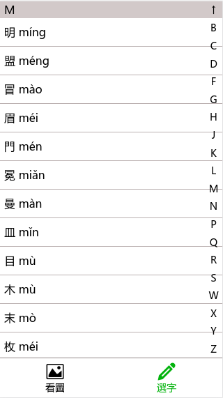

# 1. 看圖識字 - 手機網頁版

---

### 使用說明：
1. 下載文檔到本地
2. [下載](https://yun.baidu.com/s/1c2Hke8g)圖片
3. 解壓圖片到根目錄
4. 打開 index.html 文件即可瀏覽

**註：** 圖片來源，[朱邦復工作室](http://www.cbflabs.com/?id=99)

---

### 目錄結構

---

### 頁面截圖

---

# 2. 5000會意字 - 手機網頁版

---

### 使用說明：
1. 打開 char5000.html 文件即可瀏覽
